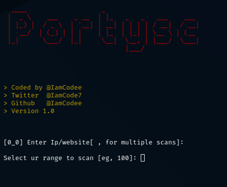

# Portysc // Simple Port scanner tool
> coded by @IamCodee

> Version 1.0

# How to install?

> git clone https://github.com/IamCodee/portysc.git

> cd /portysc

> sudo pip install -r requirements.txt /// sudo pip3 install -r requirements.txt

> python3 portysc.py

# Screenshot

